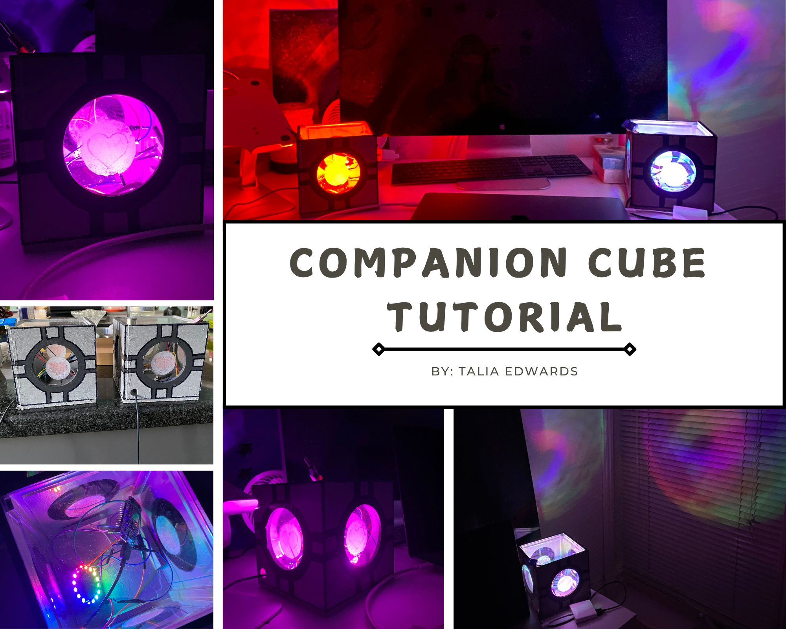

# Building a Companion Cube
## A colour changing friendship lamp 
### Summary
This tutorial will allow you to create two colour changing lamps that can communicate using WiFi. The lamps change colour when the switch is flipped to off and then back to on (you can use a button instead). The colour change is sent to a google sheet table that contains an integer value to represent the colour. Every 5 minutes the lamps read the colour integer and update their own colour to match the last colour entered in the table. This can be done through an API call to the Apps Script extension of google sheet. This will be explained in detail later. 
<br>


______________________________________________________________________________
## Materials
### Box (per box)
- Saw for wood (used a mitre Saw and a fine tooth hand saw)
- Hole saw with 2.75 inch bit 
- Hole saw with 0.5 inch bit 
- Large board of wood (0.25 inch thickness) cut into:
    - 4 pieces of 5 inch x 5 inch
    - 1 piece of wood for the base 5.25 x 5.25 (depends on thickness of the wood board)
    - 4 little pieces of wood around 1 x 2 inches to hold the glass from the base. 
    - 4 long thin pieces to provide extra support in the corners 0.25 x 0.25 x 4.75 inches 
- Dark Grey Paint 
- Black Paint or sharpy 
- Pale Grey Paint 
- Clear or Opaque Acrylic Sheet (enough to cover the 4 holes (3-inch diameter) + lid ~ 4.75 x 4.75 with small corner square cut out to press the button and take the lid off)
- Mod Podge Glue for sticking thin gift paper on the fake glass
- Pink and White gift paper to make the heart on the glass 
- Gorilla Glue for wood 

I will not have detailed instructions to assemble the box since my process was chaotic (I had never built a box before). Here is a summary:
1. Cut the pieces of wood with the saw (try to make them as precise as possible)
2. Cut the Acrylic Sheet pieces (I used a fine tooth saw)
3. Cut the holes in the 4 sides (make them slightly off-center if you are assembling the box like me)
4. Assemble the box by putting a lot of gorilla glue and holding everything in place until it dries. 
5. Paint the box.
6. Mod podge a white circle and pink heart on the fake glass.
7. Add the fake glass panels and keep them in place using little pieces of wood that are gorilla glued to the base.
8. Add the lid. (I cut the piece for the lid after the box was assembled in case the sides shifted and the measurements had to change a little bit). Cut a square in a corner to be able to lift the lid off. 
<br>


### Tech 
- 2 Neopixel Ring - 16
- 2 NodeMCU ESP8266 (WiFi connection)
- 2 switches or buttons (I recycled my buttons from random appliances in my house like an old phone)
- 2 220 ohm resistor 
- wires (MM and FM)
- soldering kit (optional)

______________________________________________________________________________

## Instructions for Hardware 

Assemble as follows: 
<br>


______________________________________________________________________________

## Instructions for Software 

In terms of software, the companion cube friendship lamp works by connecting to WiFi
using the ESP8266, it then sends an API request to a google sheet. The google sheet API must be created by using apps script (in extensions of google sheet). 
The companion cube reads a number from a single cell on the google sheet table.
It then changes to whichever colour is associated with that number.
You can have as many numbers as you want depending on how many colours you want. 
I chose to have the Arduino read from the google sheet every 5 min. 
The companion cube can also write to the single cell using the API. 
The cube writes only when the button is clicked (or switch changed to on and then off again).

### Step 1: Write the API 
See the [API files](./AppsScriptAPI). <br>
Here are the steps to make the API:
 1. Create a google sheet in google drive with a blank spreadsheet
 2. Make the title of the google sheet something significant (example: companionCube)
 3. Go to the menu at the top > extensions > Apps Script
 4. Copy Paste the API code from the [API file](./AppsScriptAPI/companionCubeAPI.js).
 5. Click Project Settings > Select 'Show "appsscript. json" manifest file in editor checkbox'.
 6. In the new file that appeared, add the `oauthScopes` key and value from the [appsscript.json file](./AppsScriptAPI/appsscript.json). 
 7. Modify the name of the sheet in your spreadsheet (mine was the default Sheet1).
    Here is an example of lines that will need to be modified:
``` js
const sheet = spreadSheet.getSheetByName('Sheet1');
```
8. Click on publish > deploy as web app.
9. You should be asked to review permissions. Allow the script to access the spreadsheet.
10. Copy the url for the script.

This link will be used to call the API in the next step. 


### Step 1.5: Test the API (optional) 
A great free tool for testing APIs is Postman.
Please download the application for the following tests.
To get the url for testing go to google sheet > Extensions > Apps Script > Deploy > Manage Deployments <br>
The URL should look like this: 
https://script.google.com/macros/s/< Deployment ID here>/exec <br>
First let's do the POST request: Create a new collection in Postman then add a request (select POST). Don't forget to add the body:
``` json
{"colour": 6}
```
Afterward, confirm by looking at the sheet that the cell has been updated (refresh your page). <br>
<br>

<br> <br>
After let's do the GET request: Add a new request (select GET). No body is needed here. <br>

<br> <br>

You now have a working API. 

### Step 2: Preparing the Arduino IDE for the ESP8266
1. Download and install the [Arduino IDE software](https://www.arduino.cc/en/Main/Software)
2. There is an add-on for the ESP8266. Open the Arduino ide and go to Files > Preferences
3. In the “Additional Boards Manager URLs” section add the link http://arduino.esp8266.com/stable/package_esp8266com_index.json
    - If another link exists, separate them with a comma 
4. Go back to the IDE > Tools > Board > Board Manager 
5. Install the ESP8266 by ESP8266 Community
6. Now when you are coding make sure that the board selected is the esp8266 and not a normal Arduino. 

 **_NOTE:_** The following libraries will need to be installed 

``` ino
#include <ESP8266WiFi.h>
#include <Adafruit_NeoPixel.h>
#include <HTTPSRedirect.h>
```

Instructions to install are found [here](https://docs.arduino.cc/software/ide-v1/tutorials/installing-libraries#). <br>
[Click here for more information on the HTTPSRedirect](https://github.com/electronicsguy/HTTPSRedirect)


### Step 3: The ESP8266 Code in the Arduino IDE. 
Please read the comments in the code to understand where changes are required and how the code works for the ESP8266. 
In summary, the ESP8266 connects to WiFi, then checks every 5 minutes if a change has been made to the colour number in the google sheet by using a get request. If the button or switch goes on and off, the colour increments by 1, and a POST request is sent to update the google sheet. 
When the button or switch is pressed (LOW), the light flashes green to indicate that the press has been detected. The user can then put the switch back in the normal position or stop pressing the button. A colour change should occur. 
**_NOTE:_** Colour 10 is a power-saving mode where the get request time is increased to 10 minutes and the light is off. 

[See esp8266 file](./esp8266Script/wifi_requests.ino)

Compile the code (make sure to go to Tools > Board > Select the Generic ESP8266 Module and also select the correct port in Tools). 
<br>
**_IMPORTANT:_**
If you don't have a mac and are not detecting the port for the esp8266 board, the issue might be that you don't have the necessary driver. To fix this on a windows computer, I went to Device Manager> other devices. <br>
Select the device with the missing driver > right-click properties > driver > update driver and select the downloaded one. <br> I had downloaded this [driver](https://www.silabs.com/developers/usb-to-uart-bridge-vcp-drivers?tab=downloads). Do your own research on this to see if this solution is correct for you and if you want to download the driver.  

Upload the code to the board. Your serial monitor should be set to 9600 baud. The initial colour is pink in my code.  
<br> <br> 

<br> <br>
Voilà - All done! 🔥 ❤️ :) 
